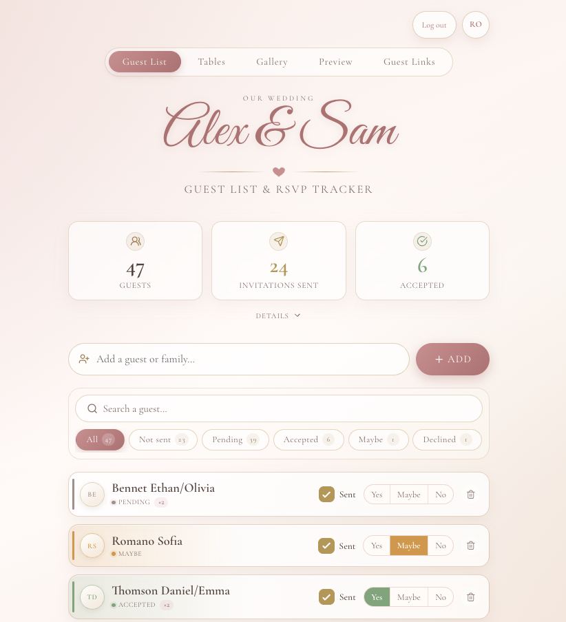
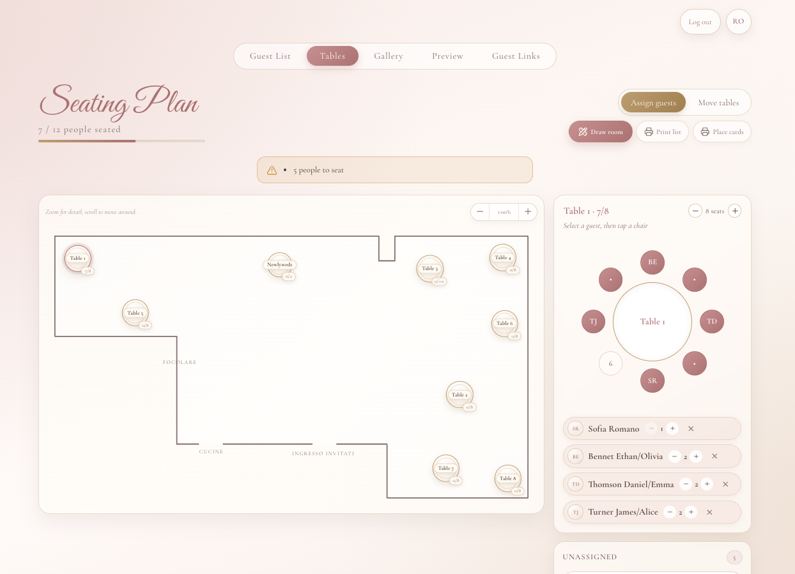
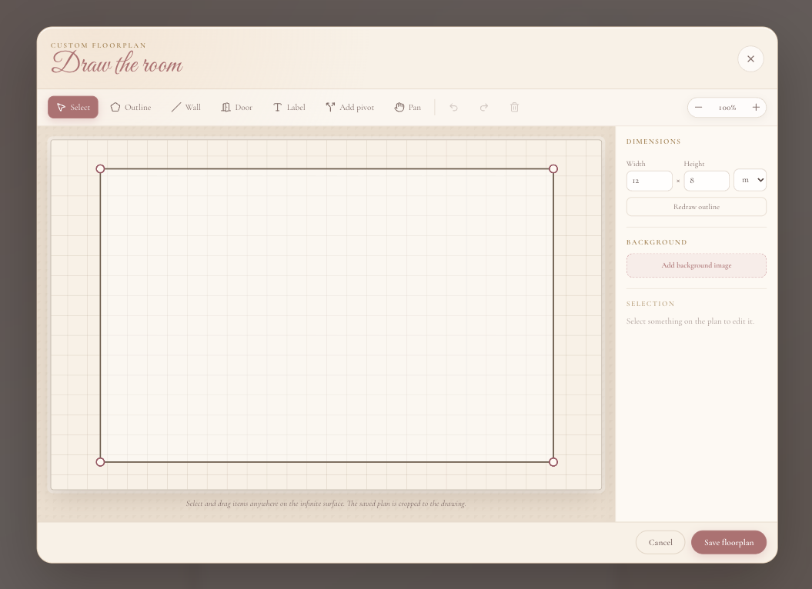
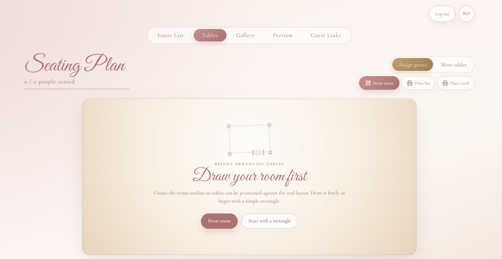
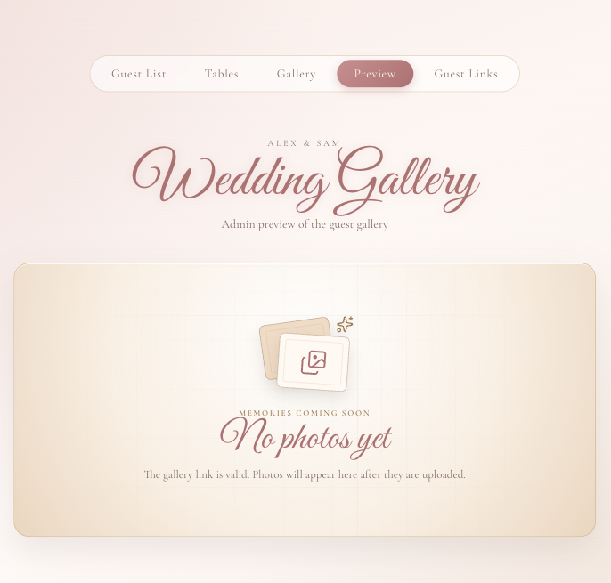

<div align="center">
  
  <h1 align="center">Vowloom 💍</h1>

**A private, self-hosted workspace for planning the people, places, and memories around your wedding.**

[](https://react.dev/)
[](https://expressjs.com/)
[](https://www.sqlite.org/)
[](https://nodejs.org/)
[](CHANGELOG.md)
[](LICENSE)

Manage invitations and replies, arrange tables visually, assign seats, and share
a private photo gallery-all from one elegant application.

</div>

## The story

Vowloom started as a quick idea for a simple wedding guest list. As new needs
arose and more ideas came to me, it grew organically into a broader planning
workspace for invitations, seating, custom floorplans, and sharing memories
with guests. It was not originally intended to be a public project, but as it
grew, making it public and easy for others to self-deploy felt like a natural
next step.

## Preview

<p align="center">
  
</p>

<p align="center">
  
  <br>
  <sub><b>Plan the seating</b> - arrange tables and assign guests from one focused workspace.</sub>
</p>

<p align="center">
  
  <br>
  <sub><b>Draw your venue</b> - shape the outline, add walls, doors, labels, and a reference image on an infinite workspace.</sub>
</p>

<table>
  <tr>
    <td width="50%" align="center">
      
      <br>
      <sub><b>Start your way</b> - draw the real room or begin with a rectangle.</sub>
    </td>
    <td width="50%" align="center">
      
      <br>
      <sub><b>A welcoming empty gallery</b> - guests know their link works before the first upload.</sub>
    </td>
  </tr>
</table>

## What's new in 1.1

- Draw a custom venue on an infinite workspace with outlines, internal walls,
  doors, labels, undo/redo, zoom, and pan.
- Add pivots to split and reshape existing walls or outline edges, and use a
  reference image as an adjustable background.
- Zoom and pan the finished seating plan while placing tables or assigning
  guests.
- Start a new installation by drawing the room or choosing a rectangular quick
  start; pages that need a room show a clear setup prompt.
- Enjoy a consistent Lucide icon set and a polished placeholder for empty guest
  galleries.

See the complete release history in the [changelog](CHANGELOG.md).

## What Vowloom does

- Tracks guests, invitation delivery, replies, and party sizes.
- Shows live totals for accepted, tentative, pending, and declined guests.
- Draws custom venue floorplans with editable outlines, walls, doors, and labels.
- Provides a zoomable seating plan with movable tables and drag-and-drop assignment.
- Produces printable guest lists and place cards.
- Hosts private wedding galleries backed by Cloudflare R2.
- Creates revocable guest gallery links with language and usage controls.
- Supports Italian, English, and Romanian.
- Keeps application data in a portable SQLite database.

## Quick start

### 1. Install

Vowloom requires Node.js 20 or newer.

```bash
git clone https://github.com/dev-reedus/vowloom.git
cd vowloom
npm install
```

### 2. Configure

```bash
cp .env.example .env
chmod 600 .env
```

At minimum, set distinct passwords and a long random token secret in `.env`:

```dotenv
COUPLE_PASSWORD=choose-a-strong-couple-password
ADMIN_PASSWORD=choose-a-different-admin-password
TOKEN_SECRET=replace-with-a-long-random-secret
WEDDING_COUPLE_NAMES=Alex & Sam
WEDDING_YEAR=2030
DEFAULT_LANGUAGE=en
```

### 3. Run

Build the frontend and start the Express server:

```bash
npm run build
npm start
```

The server listens on port `80` by default. For frontend development with Vite
hot reload, run this in a second terminal:

```bash
npm run dev
```

Vite proxies `/api` requests to the Express server.

> [!NOTE]
> Local HTTP development requires `ALLOW_INSECURE_AUTH=1`. Never enable it on a
> public deployment; production sessions require HTTPS.

## Configuration

The complete, commented configuration is in [`.env.example`](.env.example).
These are the main settings:

| Variable | Purpose |
| --- | --- |
| `WEDDING_COUPLE_NAMES` | Couple name displayed throughout the interface |
| `WEDDING_YEAR` | Optional four-digit year shown in the footer |
| `DEFAULT_LANGUAGE` | Initial language: `it`, `en`, or `ro` |
| `COUPLE_PASSWORD` | Password for day-to-day planning access |
| `ADMIN_PASSWORD` | Separate password for administrative access |
| `TOKEN_SECRET` | Protects guest tokens at rest |
| `SESSION_SECRET` | Optional separate secret for password-bound sessions |
| `R2_*` | Cloudflare R2 credentials and bucket configuration |
| `HOST_PORT` | Host port used by the deployment script |
| `APP_NAME` | Docker container/image name |
| `DATA_VOLUME` | Docker named volume or absolute host directory mounted at `/app/data` |
| `SEED_EXAMPLE_TABLES` | Set to `1` to add six demo tables to a new database |

`.env`, SQLite databases, and local guest lists are ignored by Git. The Docker
image does not contain your `.env` file.

## Guest list seeding

To prefill a new database, create `lista.txt` next to `package.json`, with one
guest or party per line:

```text
Olivia Bennett | yes | yes
Ethan Carter | yes |
Sofia Marin
Alice / James Turner | yes | yes
```

The optional columns are `Name | invitation sent | accepted`. Values such as
`1`, `x`, `yes`, `si`, `sì`, and `true` are treated as true. A `/` in a name
creates a party of two by default. Seeding only runs when the guest table is
empty, so restarts never overwrite changes made in the app.

## Authentication and privacy

The submitted password selects one of two roles:

| Role | Access |
| --- | --- |
| `couple` | Guests, tables, uploads, gallery preview and deletion, derivative generation, and existing guest links |
| `admin` | Everything above, plus guest-link management, gallery budget and metadata, R2 import, and database backup |

Sessions are stored server-side. Only a SHA-256 hash of each random session ID
is written to SQLite, while the browser receives the ID in an `HttpOnly` cookie.
Sessions expire after 30 days of inactivity or 180 days in total. Changing a
role password invalidates that role's sessions after restart.

The public surface is limited to the SPA shell, `/healthz`, and allowlisted
display configuration. App APIs require a valid session; gallery APIs require a
guest capability token.

## Architecture

```text
Browser
  │
  ▼
React + Vite ──build──▶ Express
                           ├──▶ SQLite
                           └──▶ Cloudflare R2 (optional)
```

The production Express server serves the compiled React app and API from the
same origin. SQLite holds planning data, sessions, gallery metadata, and guest
links; large gallery objects can live in R2.

## Upgrading to 1.1.0

Back up the SQLite database, pull the new version, and run `./deploy.sh`. Database
migrations run automatically at startup; no new environment variables are
required.

- Existing saved floorplans are left unchanged.
- An installation upgrading from the original hardcoded SVG receives the same
  historical room shape as an editable floorplan.
- A genuinely new installation starts without an assumed room and offers either
  the custom drawing tool or a rectangular quick start.

## Docker deployment

The included script builds the image, creates or reuses the data volume, and
restarts the container:

```bash
./deploy.sh
```

Inline values override non-empty values loaded from `.env`:

```bash
HOST_PORT=8091 ./deploy.sh
```

To build and run manually:

```bash
docker build -t vowloom .
docker run -d \
  --name vowloom \
  --restart unless-stopped \
  -p 8091:80 \
  -v vowloom-data:/app/data \
  -e WEDDING_COUPLE_NAMES='Alex & Sam' \
  -e WEDDING_YEAR='2030' \
  -e COUPLE_PASSWORD='couple-password' \
  -e ADMIN_PASSWORD='admin-password' \
  -e TOKEN_SECRET='long-random-secret' \
  vowloom
```

The container publishes plain HTTP. Place it behind an HTTPS reverse proxy in
production so secure session cookies work correctly. `/healthz` remains public
for health checks. `DATA_VOLUME` defaults to a Docker named volume; set it to an
absolute host directory if you prefer a bind mount and direct access to the
SQLite files.

## Backup and restore

Admins can download a consistent SQLite snapshot through **Save backup** or
`GET /api/backup`.

To restore one, replace the database inside the running container, remove stale
write-ahead log files, and restart:

```bash
docker cp vowloom-backup-YYYY-MM-DD.db vowloom:/app/data/vowloom.db
docker exec vowloom sh -c 'rm -f /app/data/vowloom.db-wal /app/data/vowloom.db-shm'
docker restart vowloom
```

The Docker volume survives container replacement, but it is not a substitute
for an off-device backup.

## API overview

| Area | Endpoints |
| --- | --- |
| Authentication | `POST /api/login`, `POST /api/logout`, `GET /api/me` |
| Public configuration | `GET /api/config` |
| Guests | `GET\|POST /api/guests`, `PATCH\|DELETE /api/guests/:id` |
| Tables | `GET\|POST /api/tables`, `PATCH\|DELETE /api/tables/:id` |
| Floor plan | `GET\|PUT /api/floorplan`, `GET\|POST\|DELETE /api/floorplan/background` |
| Backup | `GET /api/backup` (admin only) |
| Gallery admin | `/api/admin/gallery/*` |
| Guest gallery | `/api/gallery*` (capability token required) |

## Development

Run the complete verification suite before committing changes:

```bash
npm test
npm run build
```

`better-sqlite3` is a native dependency. The Docker image uses Node.js 20, so
use a compatible Node version when developing outside Docker.

## License

Vowloom is available under the [MIT License](LICENSE).
